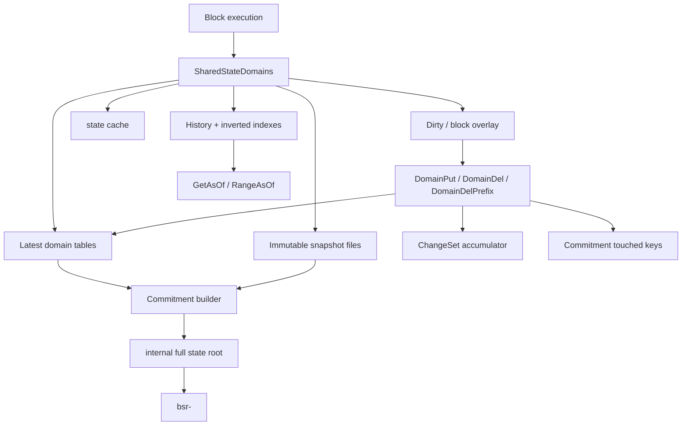

# Erigon-Style Rooted State Roadmap

Date: 2026-05-23

Status: development roadmap

Scope: fresh database only. No migration path is required. Java-tron wire
compatibility remains non-negotiable: protobuf messages, block/transaction bytes,
P2P behavior, consensus rules, and java-compatible `accountStateRoot` behavior do
not change.

This document extends the rooted generic account-KV design into an Erigon-style
state system: domain-separated latest state, historical values, inverted indexes,
immutable snapshot segments, and a separate commitment/root layer.

## Current Baseline

The current implementation already has the root envelope and a generic per-account
KV mechanism:

```text
block_hash -> internal_full_state_root

internal_full_state_root -> Account MPT

Account MPT[Keccak256(account_id20)] = StateAccountV2 {
  version
  account_proto
  account_kv_root
  account_kv_generation
  code_hash
}

account_kv_root -> AccountKV MPT
AccountKV MPT[Keccak256(domain_u16 || logical_key)] = 0x01 || value
```

It also maps many legacy flat rawdb keys into this rooted model via `RootedStore`.
That gives block-level rewind correctness, but it is not the final storage model:

- State reads still have compatibility paths and legacy accessors.
- Flat mirrors still exist for many rooted values.
- Contract code is stored as account-KV metadata instead of a separate code
  domain.
- `AccountKVGeneration` is recorded but not backed by a physical latest-state
  index.
- Efficient iteration, prefix deletion, history, pruning, and snapshots are not
  Erigon-style yet.

## Target Model

The final model has two separate layers:

1. Logical state model:
   every mutable consensus value has `(owner AccountID, domain, logical key)` or
   an explicitly named chain-global domain owned by `SystemAccountID`.

2. Physical state engine:
   latest values, historical pre-values, inverted indexes, snapshots, and
   commitment data are domain-separated. The execution layer uses a `SharedDomains`
   style read/write surface instead of rawdb state accessors.



## Domain Taxonomy

Domain IDs in `core/state/kvdomains` remain the semantic registry, but the
physical engine should group domains by access pattern.

### Primary latest domains

These are the authoritative latest state tables.

| Physical domain | Logical content | Key shape |
| --- | --- | --- |
| `AccountsDomain` | `StateAccountV3` or successor account envelope | `account_id20` |
| `AccountKVDomain` | generic account KV latest values | `owner20 || generation_u64 || domain_u16 || logical_key` |
| `CodeDomain` | immutable TVM bytecode | `code_hash32` |
| `CommitmentDomain` | commitment nodes/checkpoints | commitment-key-specific |

The current per-account KV MPT remains useful as a transition commitment
mechanism. The final physical latest state should not depend on opening a nested
MPT to iterate a domain. Latest-domain keys must be prefix-iterable.

### System/global logical domains

These stay owned by `SystemAccountID` at the logical layer:

- `SystemDynamicProperty`
- `SystemWitnessSchedule`
- `SystemProposal`
- `SystemForkVote`
- `SystemAsset`
- `SystemExchange`
- `SystemDelegation`
- `SystemAccountIndex`
- `SystemMarket`
- `SystemReward`
- `SystemShielded`
- `WitnessVoteState`

The Phase 0 prefix audit classifies PBFT/finality, TAPOS, trace, bloom, and
checkpoint-v2 rows as runtime/derived/history data rather than rooted state. The
old `SystemPBFT`, `SystemTapos`, `SystemTrace`, `SystemBloom`, and
`SystemCheckpoint` domain IDs remain reserved until cleanup, but new production
rooted writes must not use them.

### Account-local logical domains

These are owned by the natural account:

- contract storage
- contract metadata and runtime state
- witness capsule/latest/brokerage data
- account local indexes
- future account-owned protocol records

### Derived, immutable, and runtime data

Not everything belongs to the state root.

| Category | Examples | Root policy |
| --- | --- | --- |
| Immutable chain data | blocks, block hash indexes, tx bytes | not rooted state |
| Receipts / tx info | transaction info, tx indexes | derived, deleted/rebuilt on restart |
| Archive history metadata | state-history rows, snapshot metadata | separate history system |
| Runtime/finality metadata | PBFT messages, async signatures | explicit classification required |
| Caches | blooms, recent lookup caches | derived unless consensus reads them |

Before moving any prefix, the implementation must classify it as rooted,
derived, immutable, or runtime. Ambiguous records stay out of the root until
their write timing is deterministic with respect to a block.

## Target Interfaces

The execution layer should depend on domain interfaces, not rawdb prefixes.

```go
type DomainID uint16

type DomainGetter interface {
    GetLatest(domain DomainID, key []byte) ([]byte, bool, error)
    GetAsOf(domain DomainID, key []byte, txNum uint64) ([]byte, bool, error)
    IteratePrefix(domain DomainID, prefix []byte, fn func(k, v []byte) (bool, error)) error
}

type DomainWriter interface {
    DomainPut(domain DomainID, key, value []byte, txNum uint64, prev []byte) error
    DomainDel(domain DomainID, key []byte, txNum uint64, prev []byte) error
    DomainDelPrefix(domain DomainID, prefix []byte, txNum uint64) error
}
```

Typed state stores then become thin codecs over domains:

```text
DynamicPropertiesStore -> AccountKVDomain(SystemAccountID, SystemDynamicProperty, key)
WitnessStore           -> AccountKVDomain(witnessID, WitnessCapsule, key)
ContractStorageStore   -> AccountKVDomain(contractID, ContractStorage, rowKey)
CodeStore              -> CodeDomain(codeHash)
```

Rawdb state accessors should be removed from the block execution path. Rawdb
remains the right home for chain data, receipts, and freezer metadata.

## Phase 0: Prefix Audit and Classification

Goal: freeze the exact storage contract before deeper refactors.

Tasks:

- Enumerate every key prefix and singleton in `core/rawdb/schema.go`.
- Classify each record as `rooted`, `derived`, `immutable`, `history`, or
  `runtime`.
- For every rooted record, assign:
  - owner account ID
  - logical domain
  - logical key encoding
  - typed accessor owner
  - existing call sites
- For every derived/runtime record, define rebuild/delete rules for historical
  restart.
- Write the classification into a checked-in audit document:
  `docs/superpowers/specs/2026-05-23-erigon-style-prefix-audit.md`.

Acceptance:

- No `rawdb` prefix can remain unclassified.
- `ResetMutableState` deletes every replay-derived non-rooted store.
- A review can answer whether PBFT/finality records are rooted state or derived
  runtime metadata.

Estimated effort: 2-3 days.

## Phase 1: Domain Engine Skeleton

Goal: introduce an Erigon-style domain surface without changing consensus
behavior yet.

Tasks:

- Add `core/state/domains` or equivalent package with:
  - domain IDs mapped from `kvdomains`
  - latest table key encoding
  - in-memory mutation batch
  - `GetLatest`, `DomainPut`, `DomainDel`, `DomainDelPrefix`
  - metrics hooks and debug tracing
- Add block execution overlay:
  - current block dirty writes
  - parent read-through
  - discard on apply error
  - flush on block commit
- Keep current MPT root commit as the authoritative root during this phase.
- Do not remove `RootedStore` yet.

Acceptance:

- Domain engine has unit tests for put/delete/prefix delete/read-through.
- No block hash or java-compatible account-state-root fixture changes.
- `go test ./core/state ./core/rawdb ./core/blockbuffer ./core -count=1`
  passes.

Implementation start:

- `core/state/domains` now owns the Phase-1 latest-domain interfaces, latest-key
  encoding, in-memory overlay, operation batch, prefix tombstones, hooks, and
  metrics.
- `StateDB.Domains()` adapts the current account-KV trie to the domain
  interfaces while keeping the MPT/account-KV root authoritative. Prefix delete
  against `StateDB` remains explicitly unsupported until Phase 2 adds a physical
  latest-state index.

Estimated effort: 5-7 days.

## Phase 2: Latest-State Physical Index

Goal: make account KV values physically prefix-iterable and generation-aware.

Tasks:

- Add latest-state physical keys:

  ```text
  latest_key = owner20 || generation_u64 || domain_u16 || logical_key
  ```

- On every `SetAccountKV` / `DeleteAccountKV`, write the domain latest table in
  the same atomic commit path as the current KV root.
- Implement:
  - `IterateAccountKV(owner, domain, prefix)`
  - `DeleteAccountKVPrefix(owner, domain, prefix)`
  - `ResetAccountKV(owner)` that bumps generation and leaves old latest keys
    unreachable.
- Make prefix deletion use latest index, not the hashed MPT.
- Add consistency checks:
  - if a latest value exists, opening the matching root at head returns the same
    value
  - generation bump hides old keys

Acceptance:

- Contract selfdestruct/recreate or account KV reset does not scan old storage.
- Domain iteration is O(number of matching keys), not O(size of trie).
- Current rooted tests and restart tests pass.

Implementation:

- `core/rawdb` now owns `state-kv-latest-v2-` with key shape
  `owner20 || generation_u64 || domain_u16 || logical_key`, plus
  `state-kv-generation-v2-` as the per-account generation high-water used to
  assign a higher generation after delete/recreate without scanning old rows.
- `StateDB.Commit` writes the physical latest index and generation marker in
  the same commit path that updates the account-KV MPT root. `SetAccountKV` and
  `DeleteAccountKV` remain overlay-only.
- `StateDB.IterateAccountKV` and `DeleteAccountKVPrefix` read the latest index
  and merge the dirty overlay, so domain prefix deletion no longer depends on
  hashed MPT iteration.
- Block application and producer block building route latest-index writes
  through `blockbuffer`, keeping unsolidified and throwaway writes discardable.

Estimated effort: 7-10 days.

## Phase 3: Native Typed Stores, Remove RootedStore From Execution

Goal: stop depending on legacy rawdb state accessors inside consensus execution.

Tasks:

- For each rooted domain, define a typed store:
  - dynamic properties
  - witness schedule
  - witness capsules
  - votes
  - proposals
  - assets
  - exchanges
	  - market
	  - delegation/reward
	  - shielded global stores
- Replace `rawdb.WriteXxx(rootedDB, ...)` calls in apply/build/actuator paths
  with typed domain calls.
- Keep legacy rawdb accessors only for:
  - chain data
  - tests that explicitly exercise legacy compatibility
  - temporary adapters outside block execution
- Fail tests when block execution writes a rooted-state prefix through rawdb.

Acceptance:

- `RootedStore` is not used by `applyBlock`, `processBlock`, actuators,
  maintenance, reward, producer build, or backend validation paths.
- Flat state mirrors are no longer required for canonical head correctness.
- Restart from historical height works without relying on flat mirrors.

Estimated effort: 10-15 days.

## Phase 4: Content-Addressed Code Domain

Goal: make contract code Erigon-style: immutable code bytes in a code domain,
account envelope commits the code hash.

Tasks:

- Add physical `CodeDomain[code_hash32] = code_bytes`.
- Change `StateDB.SetCode`:
  - compute Keccak code hash
  - stage code bytes into `CodeDomain`
  - stage hash into the account envelope
- Change `StateDB.GetCode`:
  - read account code hash
  - load bytes from `CodeDomain`
  - never read flat `c-` as state
- Change `GetCodeHash` so `StateAccountV2.CodeHash` is authoritative.
- Update selfdestruct/delete/recreate logic:
  - account deletion clears selected code hash
  - code bytes may remain content-addressed until pruning
- Update history capture so code changes record hash and bytes as needed.

Acceptance:

- Contract deploy, call, selfdestruct, recreate, and historical reads pass.
- Code bytes are reachable from the internal full root through `CodeHash`.
- No state path reads legacy `c-` for canonical state.

Estimated effort: 5-8 days.

## Phase 5: Change Sets and Block/Tx Numbering

Goal: record previous values for every domain write and make unwind/replay
possible without re-executing from genesis.

Tasks:

- Define monotonic state transaction numbers:
  - `blockNum -> beginTxNum/endTxNum`
  - simple first version can use one state txNum per block
  - later version can use per-transaction txNum for finer history
- For every `DomainPut` / `DomainDel`, record:

  ```text
  domain
  key
  txNum
  previousValue
  hadPreviousValue
  ```

- Add block change-set storage keyed by block hash and block number.
- Implement unwind:
  - undo domain writes down to target block
  - restore head pointers and internal root index
  - keep immutable blocks/tx bytes
- Keep existing replay-based `RestartSyncFromHeight` as the correctness oracle
  until unwind is proven.

Acceptance:

- Applying A then unwinding to parent yields byte-identical latest state.
- Reorg across maintenance boundary uses change sets, not only buffer discard.
- Replay restart and change-set unwind produce the same root at sampled heights.

Estimated effort: 8-12 days.

## Phase 6: Historical Reads

Goal: support `GetAsOf` and archive queries from latest + history, not ad hoc
state-history rows.

Tasks:

- Implement `GetAsOf(domain, key, txNum)`:
  - check current overlays when relevant
  - consult latest if key unchanged after target
  - consult history/change-set index for previous value
- Add `RangeAsOf(domain, prefix, txNum)` for account storage and indexes.
- Rework existing archive RPC/state-history paths to use domain history.
- Preserve existing `HistoryEnabled` behavior during transition; make the new
  domain history a stricter superset.

Acceptance:

- `GetAccountAt`, `GetStorageAt`, contract code at block, and witness/system
  state at block work for historical heights.
- Results match replay-built roots for sampled blocks.
- No live-state fallback is used for archive answers when history is available.

Estimated effort: 8-12 days.

## Phase 7: Aggregator and Immutable Snapshots

Goal: move old latest/history segments out of hot Pebble into immutable files,
with visible snapshot views published atomically.

Tasks:

- Define snapshot file families for each domain:
  - latest key/value segment
  - key accessor
  - existence filter
  - history segment
  - inverted index segment
- Add an aggregator service:
  - builds step files from hot DB ranges
  - builds accessors
  - merges small files
  - publishes a visible snapshot set atomically
  - marks garbage files for later deletion
- Integrate with existing freezer directories and lifecycle.
- Add read path:
  - overlay
  - state cache
  - hot latest DB
  - visible snapshot files

Acceptance:

- Restart opens visible snapshot metadata without rebuilding from scratch.
- Latest reads can hit snapshots after hot data is frozen.
- Snapshot merge never exposes overlapping or partially indexed file sets.
- Corrupt/missing accessor fails closed and can rebuild.

Estimated effort: 12-18 days for a first production-quality version.

## Phase 8: Commitment Domain and Root Builder

Goal: make the internal full state root a commitment over the domain state,
rather than a side effect of nested MPT access patterns.

Tasks:

- Define commitment input:
  - account envelope fields
  - account KV latest values by owner/domain/key
  - code hash references
  - system account logical domains
- Track touched keys during domain writes.
- Implement incremental commitment update:
  - update only touched accounts/domains
  - persist commitment nodes/checkpoints in `CommitmentDomain`
- During transition, compute both:
  - current nested-MPT full root
  - new domain commitment root
- Compare both roots under a debug gate where equivalence is expected; when the
  domain commitment becomes authoritative, write only it to `bsr-<blockHash>`.

Acceptance:

- Commitment root is deterministic across fresh replay.
- Reopening by block root reconstructs all rooted state.
- Domain latest/history/snapshot reads agree with the committed root.
- Block hashes and java-compatible `accountStateRoot` remain unchanged.

Estimated effort: 10-15 days.

## Phase 9: Pruning Modes

Goal: make storage modes explicit and safe.

Modes:

- `archive`: keep all domain history and snapshots.
- `full`: keep latest state plus enough history for configured reorg/restart
  depth.
- `snap`: rely on immutable snapshots plus recent hot history.

Tasks:

- Add pruning configuration.
- Define retention policy per domain.
- Prove pruning never deletes:
  - latest values needed for current head
  - history inside reorg safety window
  - code bytes reachable by retained roots/history
  - commitment nodes needed by retained roots
- Add offline integrity checker.

Acceptance:

- Pruned node can restart, sync forward, and handle configured-depth reorgs.
- Archive node answers historical state across retained range.
- Pruning is idempotent and crash-safe.

Estimated effort: 7-12 days after snapshots/history exist.

## Phase 10: Remove Legacy Flat State Semantics

Goal: finish the cleanup that turns the domain engine into the only state engine.

Tasks:

- Delete or deprecate rooted-state rawdb accessors for prefixes that moved.
- Keep rawdb accessors for immutable chain data and explicitly derived indexes.
- Remove `RootedStore` from production code. It may remain temporarily in tests
  that compare legacy encodings.
- Add static checks or tests preventing new block execution code from importing
  rawdb state accessors.
- Update docs and developer guidance.

Acceptance:

- Searching for `rawdb.Write*` in actuator/apply/maintenance paths shows only
  chain-data or derived-index writes.
- Flat state prefixes can be rebuilt or are absent on a fresh DB.
- All dailyBuild and java-tron parity tests pass.

Estimated effort: 4-7 days.

## Validation Matrix

Every phase must pass the normal Go suite. Phases 3, 4, 5, 8, and 10 also require
dailyBuild.

Required test groups:

- Root determinism:
  - same blocks -> same internal root
  - same root -> same state
- Rewind/restart:
  - restart from genesis
  - restart from recent height
  - restart across maintenance boundary
  - restart after contract deploy/storage writes
- Reorg:
  - fork switch across maintenance
  - witness stats and active schedule rewind
  - contract storage/code rewind
- Typed domains:
  - dynamic properties
  - witness capsule and votes
  - proposal/fork stats
  - asset/exchange/market
  - delegation/reward
  - shielded/global stores
- Contract lifecycle:
  - deploy
  - call
  - storage overwrite/delete
  - selfdestruct/recreate
  - code hash and bytecode history
- Archive:
  - account at block
  - storage at block
  - code at block
  - system state at block
- Cross-implementation:
  - java-tron accepts go-tron-produced blocks
  - receipt parity
  - account/resource/proposal/witness parity

## Development Order and Gates

Do not merge phases that leave an intermediate red state. The preferred sequence:

1. Prefix audit.
2. Domain skeleton with no behavior change.
3. Latest physical index.
4. Typed stores and `RootedStore` removal from execution.
5. Code domain.
6. Change sets and unwind.
7. Historical reads.
8. Snapshots/aggregator.
9. Commitment domain.
10. Pruning.
11. Legacy flat cleanup.

Each phase should have its own implementation plan under `docs/superpowers/plans`
with:

- exact files to touch
- data key encodings
- call-site replacement list
- tests to add
- expected commands
- rollback notes

## Risk Register

### Root/index divergence

Writing a value into the latest domain but not into the commitment path is the
highest-risk failure mode. Every domain write must go through one shared method.

Mitigation:

- no direct Pebble writes for state domains
- debug consistency check after block commit
- sampled root reconstruction tests

### Code domain reachability

Code bytes are immutable but must not be pruned while reachable by any retained
root/history entry.

Mitigation:

- code reference tracking by `CodeHash`
- retention tied to root/history retention
- integrity checker for missing code hashes

### PBFT/finality timing

PBFT messages can arrive after block execution. Such data may not have a stable
place in the block state root.

Mitigation:

- classify PBFT records explicitly in Phase 0
- keep asynchronous signatures as runtime/derived unless block-deterministic
- reset/rebuild derived finality indexes on historical restart

### Iterator semantics

The current hashed account-KV MPT cannot support efficient prefix iteration.

Mitigation:

- make latest physical index load-bearing before replacing stores that need
  iteration
- test `DeletePrefix` against large contract storage

### Java-tron compatibility

The internal root may change, but block bytes and java-compatible root behavior
must not.

Mitigation:

- never write internal root into block proto unless java-tron does
- keep java `accountStateRoot` calculation separate
- dailyBuild after high-risk phases

## Rough Effort

For one engineer familiar with the codebase:

| Milestone | Effort |
| --- | ---: |
| Phases 0-4: root-native latest state and code domain | 5-7 weeks |
| Phases 5-6: change sets and historical reads | 3-5 weeks |
| Phases 7-9: snapshots, commitment, pruning | 5-8 weeks |
| Phase 10: cleanup and hardening | 1-2 weeks |

Total: 14-22 weeks for an Erigon-style production version. The lower bound
assumes no major java-tron parity regressions and a block-level history model
before per-transaction history. Per-transaction history, aggressive snapshot
compaction, and full pruning hardening push toward the upper bound.

## Definition of Done

The Erigon-style target is complete when:

- block execution uses domain stores, not rawdb state prefixes
- every consensus mutable state value is classified and either rooted or
  explicitly derived/runtime
- latest state is prefix-iterable by domain
- account KV generation is load-bearing
- contract code is content-addressed and committed by code hash
- `GetAsOf` is served by domain history, not live fallback
- snapshots can serve old latest/history ranges
- pruning preserves configured roots/history
- internal full state root is deterministic and reconstructable
- java-tron wire compatibility and dailyBuild remain green
